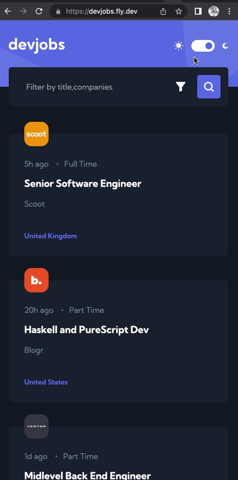
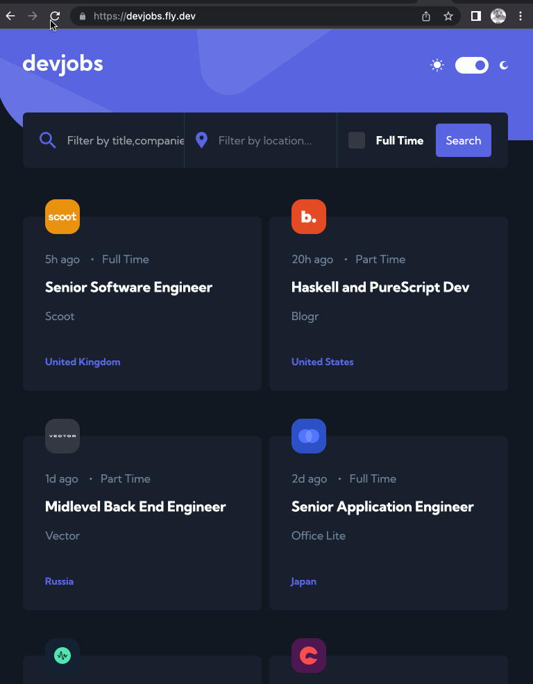
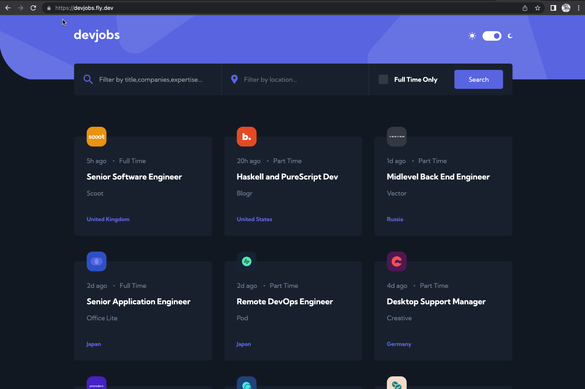

# Frontend Mentor - Devjobs web app solution

This is a solution to the [Devjobs web app challenge on Frontend Mentor](https://www.frontendmentor.io/challenges/devjobs-web-app-HuvC_LP4l). Frontend Mentor challenges help you improve your coding skills by building realistic projects.

## Table of contents

- [Overview](#overview)
  - [The challenge](#the-challenge)
  - [Screenshot](#screenshot)
  - [Links](#links)
- [My process](#my-process)
  - [Built with](#built-with)
  - [What I learned](#what-i-learned)
  - [Continued development](#continued-development)
  - [Useful resources](#useful-resources)
- [Author](#author)
- [Acknowledgments](#acknowledgments)

## Overview

### The challenge

Users should be able to:

- View the optimal layout for each page depending on their device's screen size
- See hover states for all interactive elements throughout the site
- Be able to filter jobs on the index page by title, location, and whether a job is for a full-time position
- Be able to click a job from the index page so that they can read more information and apply for the job
- **Bonus**: Have the correct color scheme chosen for them based on their computer preferences. _Hint_: Research `prefers-color-scheme` in CSS.

### Screenshot





### Links

- Solution URL: [github url](https://github.com/smallmacro/smallmacro.github.io/tree/main/challenge6)
- Live Site URL: [Devjobs](https://devjobs.fly.dev/)

## My process

### Built with

- Semantic HTML5 markup
- CSS custom properties
- Flexbox
- CSS Grid
- Mobile-first workflow
- [React](https://reactjs.org/) - JS library
- [Vite](https://vitejs.dev/) - React Tooling
- [React Router](https://reactrouter.com/en/main) - React Router
- [Tailwind Css](https://tailwindcss.com/) - For styling component
- Express
- React Query
- Jest and react-test-library for backend intergation test
- Cypress for E2E tesing
- Vitest for Frontend Unit testing

### What I learned

1. Flexbox or Grid: When aligning items along the main axis, auto margins are the way to go.
2. In tailwind-css `prefers-color-scheme` can be automatically triggered by setting the classname `dark:` or triggered by manually.`window.matchMedia('(prefers-color-scheme: dark)').matches` is true in Chrome while is false in Firefox.

   ```javascript
   const [checked, setChecked] = useState(false);
   useEffect(() => {
     if (
       checked ||
       localStorage.theme === "dark" ||
       (!("theme" in localStorage) &&
         window.matchMedia("(prefers-color-scheme: dark)").matches)
     ) {
       document.documentElement.classList.add("dark");
     } else {
       document.documentElement.classList.remove("dark");
     }

     return () => {};
   }, [localStorage, checked]);
   ```

3. React Router enable to define the `loader` function to load data before loading the component
4. Stop Propagation from children elemement to parent element by using `event.stopPropagation()`
5. Setting Dynamic color tailwind css, such as `bg-[${themeColor}]` , is not working as it against the constraint of Tailwind css. The solution is to set inline-style within the element.
6. [REST Client](https://marketplace.visualstudio.com/items?itemName=humao.rest-client) is a great tools for testing backend api functions. Can't figure out how to post a Array data .
7. `nodemon` will watch the files in the directory in which nodemon was started, and if any files change, nodemon will automatically restart your node application.
8. Deleting remote branches.To delete a remote branch, you can’t use the git branch command. Instead, use the git push command with --delete flag, followed by the name of the branch you want to delete. You also need to specify the remote name (origin in this case) after git push.

```
git push origin --delete test
```

9. deploy to fly.io. `fly launch` `fly deploy`
10. Github Pages does not support dynamic route.
11. React router loader function only suggest a timing to preload the data needed to render components, but it does not serve as a cache.
12. Streaming deploying of the frontend

```json
{
  "scripts": {
    // ...
    "build:ui": "rm -rf dist && cd ../frontend && npm run build && cp -r dist/ ../server",
    "dev": "nodemon index.js",
    "deploy": "fly deploy",
    "deploy:full": "npm run build:ui && npm run deploy"
  }
}
```

13. redirect the `Express` get requests to `/dist/index.html` to prevent the `can not get /jobs/:id error` when refreshing the path.

14. In Test-Driven Development, we write the test function bedore the actual implementation of functions.

15. `Mongoose` do the similar join operation like relational database by usinbg `populate`.The functionality of the `populate` method of Mongoose is based on the fact that we have defined "types" to the references in the Mongoose schema with the ref option:

```javascript
const users = await User.find({}).populate("jobs", { comapny: 1, postion: 1 });
//{company: 1,postion:1} means choosing the fields we want to include, like the Mongo syntax

response.json(users);
```

16. Problems of Token-based authentication

- If a token without limited time, the server cannot revoke the access right of token holder
- If a token with limited time, the shorter the expiration time, the more safe the solution is, but the user must login to the system more frequently
  - (server side session,regular database is complicated and slower)save the info about each token to backend database and check each API request if the access right corresponding to the token is still valid.
  - (key-value database such as Redis) save the session corresponding to a token to a key-value-database.
  - token is quite often just a random string, not including any information about the user.
  - For each API request, the server fectched the relevant information about the identity of the user from the database.
  - Instead of using authorization-header, cookies are used for transfering the token between the client and th server.
  - Usernames, passwords and applications using token authentication must always be used over HTTPS.
  - Due to the consideration of risks of XSS(Cross Site Scripting) attacks, saving a token in the local storage is not a good idea.
  - HttpOnly cookies may be a good option.

17. `Snapshot` testing is to compare the HTML code defined by the component after it has changed to the HTML code that existed before it was changed.
18. Cypress is a powerfull tool for End to End testing.`it.only` will tell cypress to only run these test case instead of automatically running all of them. Cypress also enable to define customer command.

```javascript
Cypress.Commands.add("login", ({ username, password }) => {
  cy.request("POST", "http://localhost:3001/api/login", {
    username,
    password,
  }).then(({ body }) => {
    localStorage.setItem("loggodJobUser", JSON.stringify(body));
    cy.visit("http://localhost:3000");
  });
});
```

when running E2E test, it is the best to empty the database and possibly format it before the tests are run.

19. Useful libraries

- [loadash](https://www.npmjs.com/package/lodash) for handling complicated data
- [date-fns](https://github.com/date-fns/date-fns) for handle time and dates
- [recharts](https://recharts.org/en-US/) for displaying graphs
- [ React Google Analytics](https://github.com/react-ga/react-ga) for gathering of analytics data

20. GraphQL. A `schema` describes the data sent between the cilent and the server. GraphQL query describes only the data moving between a server and the client. GraphQL API uses can be saved into a relational database, documnet database, or to other servers which a GraphQL server can access with for example

```javascript
//Schema
const typeDefs = gql`
type Person {
  name: String!
  phone: String
  street: String!
  city: String!
  id: ID!
}

type Query {
  personCount: Int!
  allPersons: [Person!]!
  findPerson(name: String!): Person
}
`

const resolvers = {
  Query: {
    personCount: () => persons.length,
    allPersons: () => persons,
    findPerson: (root, args) =>
      persons.find(p => p.name === args.name)
  }
}


//query
query {
  personCount
}
```

21. GraphQL Server. pass `Schema` and `resolver` to `new ApolloServer()`. the GraphQL will provide default resolver for given shcema Type in some condition.

```javascript
const { ApolloServer, gql } = require('apollo-server')
const server = new ApolloServer({
  typeDefs,
  resolvers,
  //context given to all resolvers as their third parameter.
  context: async ({ req }) => {
    const auth = req ? req.headers.authorization : null
    if (auth && auth.toLowerCase().startsWith('bearer ')) {
      const decodedToken = jwt.verify(
        auth.substring(7), JWT_SECRET
      )
      const currentUser = await User.findById(decodedToken.id).populate('friends')
      return { currentUser }
    }
  }
})

mutation {
  addPerson(
    name: "Pekka Mikkola"
    phone: "045-2374321"
    street: "Vilppulantie 25"
    city: "Helsinki"
  ) {
    name
    phone
    address{
      city
      street
    }
    id
  }
}
```

22. GraphQL Client. React application can communicate with a GraphQL Server using the client. By wrapping the App component, the client can be made accessible for all components of the application.
    `npm install @apollo/client graphql`

```javascript
import {
  ApolloClient,
  ApolloProvider,
  HttpLink,
  InMemoryCache,
} from "@apollo/client";

const client = new ApolloClient({
  cache: new InMemoryCache(),
  link: new HttpLink({
    uri: "http://localhost:4000",
  }),
});

ReactDOM.createRoot(document.getElementById("root")).render(
  <ApolloProvider client={client}>
    <App />
  </ApolloProvider>
);

// within the app component
import { gql, useQuery } from "@apollo/client";
const queryStr = gql`
//
`;
const App = () => {
  const result = useQuery(queryStr, {
    pollInterval: 2000, // poll the server every 2000ms
  });
  //the result is an object with multiple fields.
  if (result.loading) {
    return <div>Loading...</div>;
  }
  //.....
};

//----------------------------------------
// in order to use variables , we must  also name our queries
const queryWithVariables = gql`
  query findPersonByName($nameToSearch: String!) {
    findPerson(name: $nameToSearch) {
      name
      phone
      address {
        street
        city
      }
    }
  }
`;
//----------------------------------------
import { gql, useMutation } from "@apollo/client";
//mutation
const mutationStr = gql`
  mutation createPerson(
    $name: String!
    $street: String!
    $city: String!
    $phone: String
  ) {
    addPerson(name: $name, street: $street, city: $city, phone: $phone) {
      name
      phone
      id
      address {
        street
        city
      }
    }
  }
`;
//The hook returns an array, the first element of which contains the function to cause the mutation.
const [createPerson] = useMutation(mutationStr);
//The query variables receive values when the query is made:
createPerson({ variables: { name, phone, street, city } });
```

22. The Apollo Client cannot automatically update the cache of an application,.
    solutions:

    - Add ` pollInterval: 2000` when using `useQuery` to poll the server every two seconds. Bad side: cause extro web traffice
    - use `useMutation`'s `refectchQueries` parameter. Bad side: if one user now updates the state of the server, the changes do not show to other users immediately.

    ```javascript
    const [createPerson] = useMutation(CREATE_PERSON, {
      refetchQueries: [{ query: ALL_PERSONS }],
    });

    //fragments
    ```

23. The third type is Subscribtion.

24. Add `nodemon` to enable auto-loading. Another alternative module is `ts-node-dev`

25. Typescript Utility Types, `Pick` and `Omit`

```javascript
type DiaryEntry {
  //...
}

export type NonSensitiveDiaryEntry = Omit<DiaryEntry, 'comment'>;

  const getNonSensitiveEntries =
    (): Pick<DiaryEntry, 'id' | 'date' | 'weather' | 'visibility'>[] => {
      // ...
    }
```

25. CI/CD pipeline. `Github Actions`,`workflows`, `jobs`. A typical execution of a workflow looks like this:

- Triggering event happens(ex, a push to the main branch)
- The workflow with that trigger is executed
- Cleanup

The hierarachy of a workflow:
Workflow -> Job(run in Parallel) ->A Step(run sequentially) performs an individual task(a customized action or any actions pubilished by the community)

26. YAML configuration file.A basic workflow contains three elements in a YAML document:

- name
- on(triggers): the events that trigger the workflow to be executed. The events includes events on Github(someone pushes a commit to a repository), scheduled events( using the `cron-` syntax) and external events(such as Slack messaging app)
- jobs: The separate jobs that workflow will execute

```YAML
name: Deployment pipeline

on:
  push:
    branches:
      - master

jobs:
  simple_deployment_pipeline:
    runs-on: ubuntu-20.04
    steps:
      - uses: actions/checkout@v3
      - uses: actions/setup-node@v3
        with:
          node-version: "16" #give a 'parameter' to the action
      - name: npm install
        run: npm install
      - name: lint
        run: npm run eslint
      - name: build
        run: npm run build
      - name: test
        run: npm run test
      - name: e2e tests
        uses: cypress-io/github-action@v2
        with:
          command: npm run test:e2e
          start: npm run start-prod
          wait-on: http://localhost:5000
```

27. Form submit event definition from TS official website:

```javascript
 onSubmit={(e: React.SyntheticEvent) => {
    e.preventDefault();
    const target = e.target as typeof e.target & {
      email: { value: string };
      password: { value: string };
    };
    const email = target.email.value; // typechecks!
    const password = target.password.value; // typechecks!
    // etc...
  }}
```

### Continued development

- ~~Load json data from backend~~
- ~~configure the base url in react router.~~
- ~~search and filter the jobs~~
- ~~deploy it with a docker.~~(Automatically done while delpoy to flyio)
- Use `React Query` ~~in the loader function~~ as a cache.(done)
- ~~Extract communicaiton with the backend into a seperate module~~
- ~~deploy the whole app to fly.io~~
- ~~connect the backend to Database(mongoDb)~~
- ~~Implement the CRUD operations in the backend.~~
- ~~Fix the `jobs/:id` path;~~
- ~~Use `mongoose` as mongodb modeling,validation for node.js~~
- ~~Add Unit test for job related api function.~~
- ~~Add User model~~
- Fix the issue of loading invalid path of a job
- Add utils functions.
  - user register
  - ~~user login~~
  - user log out. `window.localStorage.clear()` or `window.localStorage.reomveItem('loggedJobUser')`
  - user edit profile
  - email verification
  - user reset password
- Add role authentication and authorization
- Server Side Session and client side localStorage .
- `Load More` or pagination

### Useful resources

- [React - Prevent Event Trigger on Parent From Child](https://stackoverflow.com/questions/37568550/react-prevent-event-trigger-on-parent-from-child)
- [Toggling dark mode manually](https://v2.tailwindcss.com/docs/dark-mode)
- [fullstack open course](https://fullstackopen.com/en/)
- [Pagination vs. Infinite Scroll vs. Load More Explained](https://crocoblock.com/blog/pagination-vs-infinite-scroll/)
- [Node.js User Authentication Guide](https://blog.loginradius.com/engineering/guest-post/nodejs-authentication-guide/)

## Author

## Acknowledgments
